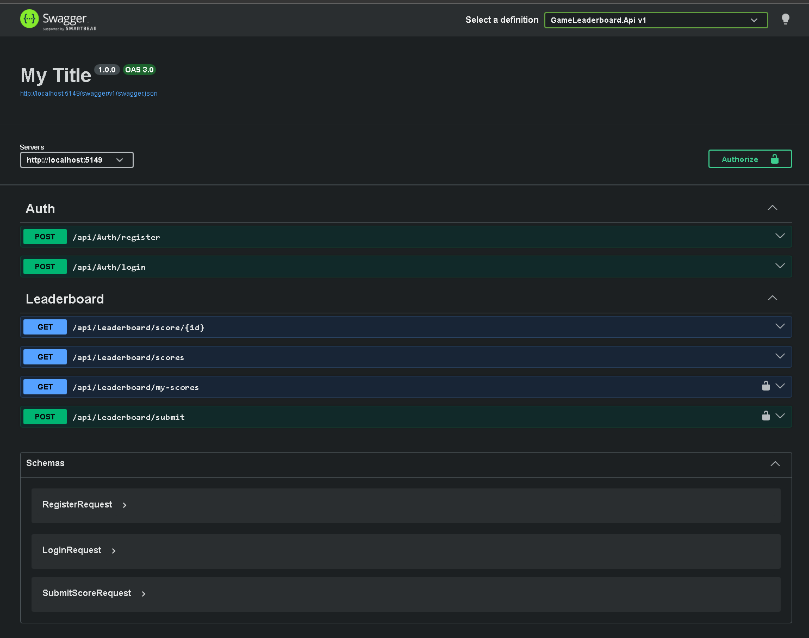

# GameLeaderboard

REST API for game scores and leaderboards. Portfolio project built during my transition from Unity to .NET backend.

## Overview

A small but real ASP.NET Core API where users can register, log in, submit scores, and view leaderboards. Authentication is JWT-based and the data layer uses EF Core against SQL Server. The solution is split into the standard layers (API, Infrastructure, Domain) plus unit and integration test projects.



## Tools used

- **.NET 10 / ASP.NET Core** — REST API.
- **EF Core 10** — data access, SQL Server provider in production, SQLite in-memory provider in integration tests.
- **JWT Bearer authentication** — `Microsoft.AspNetCore.Authentication.JwtBearer`.
- **FluentValidation** — request validation.
- **Serilog** — structured logging, configured via `appsettings.json`.
- **NSwag** — OpenAPI document + Swagger UI in Development.
- **xUnit + FluentAssertions** — both test projects.
- **Moq** — used by unit tests for mocking dependencies.
- **Microsoft.AspNetCore.Mvc.Testing** — used by integration tests for in-memory hosting (`WebApplicationFactory<Program>`).

## Project layout

```
GameLeaderboard.Domain/             Entities and domain types
GameLeaderboard.Infrastructure/     EF Core, services, validators, JWT setup
GameLeaderboard.Api/                Controllers, Program.cs, OpenAPI config
GameLeaderboard.UnitTests/          Class-level tests with mocked dependencies
GameLeaderboard.IntegrationTests/   End-to-end tests through the real pipeline
```

## Prerequisites

- **.NET 10 SDK**
- **SQL Server LocalDB** (for Development) — ships with Visual Studio, or install via the SQL Server Express LocalDB component.
- **`dotnet-ef`** tool, only if you want to run migrations from the command line: `dotnet tool install --global dotnet-ef`

## Running the tests

Both test projects use xUnit and can be run from the solution root.

### Unit tests

```bash
dotnet test GameLeaderboard.UnitTests
```

These don't need any database or configuration — they test classes in isolation, using Moq for dependencies and EF Core's InMemory provider where a `DbContext` is needed.

### Integration tests

```bash
dotnet test GameLeaderboard.IntegrationTests
```

These boot the real ASP.NET Core pipeline in memory and make HTTP calls against it. The database is replaced with SQLite `:memory:` so no external setup is required.

For the full explanation of how the integration test setup works (factory, environment, schema creation, etc.), see [`GameLeaderboard.IntegrationTests/README.md`](GameLeaderboard.IntegrationTests/README.md).

## Running the API

The environment (`Development` or `Production`) is selected via `ASPNETCORE_ENVIRONMENT`, which is set in `GameLeaderboard.Api/Properties/launchSettings.json`. Change the value of the profile you want to use, or duplicate the profile and create a `Production` one.

The matching `appsettings.{Environment}.json` file is loaded on top of the base `appsettings.json`. Each environment file can override anything from the base — typically JWT settings, the connection string, and the Serilog log levels for that environment.

### Development

1. Create `GameLeaderboard.Api/appsettings.Development.json` if it isn't there yet, with at least:

   ```json
   {
     "Serilog": {
       "MinimumLevel": {
         "Default": "Debug",
         "Override": {
           "Microsoft": "Information",
           "Microsoft.EntityFrameworkCore.Database.Command": "Information",
           "Microsoft.Hosting.Lifetime": "Information",
           "System": "Warning"
         }
       }
     },
     "Jwt": {
       "Secret": "<at least 32 characters of random text>",
       "ExpiryHours": 24
     },
     "ConnectionStrings": {
       "GameLeaderboard": "Server=(localdb)\\mssqllocaldb;Database=GameLeaderboard;Trusted_Connection=True;TrustServerCertificate=True;"
     }
   }
   ```

2. Apply migrations (the API also does this on startup, but you can do it manually):

   ```bash
   dotnet ef database update --project GameLeaderboard.Infrastructure --startup-project GameLeaderboard.Api
   ```

3. Make sure the active `launchSettings.json` profile has `"ASPNETCORE_ENVIRONMENT": "Development"`, then run:

   ```bash
   dotnet run --project GameLeaderboard.Api
   ```

   Swagger UI is available at http://localhost:5149/swagger in Development (port defined in `launchSettings.json`).

### Production

1. Provide a real `appsettings.Production.json` (or use environment variables / a secret manager) with:

   ```json
   {
     "Serilog": {
       "MinimumLevel": {
         "Default": "Information",
         "Override": {
           "Microsoft": "Warning",
           "System": "Warning"
         }
       }
     },
     "Jwt": {
       "Secret": "<long, random, kept secret>",
       "ExpiryHours": 1
     },
     "ConnectionStrings": {
       "GameLeaderboard": "<your production SQL Server connection string>"
     }
   }
   ```

2. Set `"ASPNETCORE_ENVIRONMENT": "Production"` in the `launchSettings.json` profile you're running (or set the env var another way), then run:

   ```bash
   dotnet run --project GameLeaderboard.Api
   ```

   Migrations are applied automatically on startup (`MigrateDb()` in `Program.cs`).

## Notes

This is a work-in-progress portfolio project, not a polished production app. Things still on the list: more endpoints, refresh tokens, role-based authorization, CI pipeline, containerization, and more thorough test coverage.
